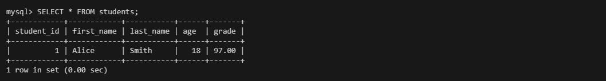
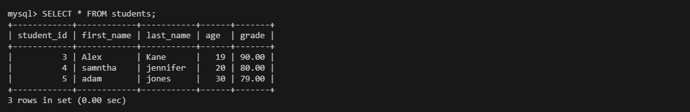

## Task 1: Calculate Area with Conditions
 


## Task 2: Generate Fibonacci Series


## Task 3: MySQL Database Operations with Python

1. Creating Database using SQL commands in MySQL database.
    ```
    CREATE DATABASE student_db;
    ```
    
2. Creating Tables in Database.
   ```
   USE student_db;
   ```
   ```
   CREATE TABLE students (student_id INT AUTO_INCREMENT PRIMARY KEY,first_name VARCHAR(50),last_name VARCHAR(50),age INT,grade DECIMAL(5,2));
   ```
    

3. Executing the Insert_query and adding the first record into the database table.
    

4. Executiing the update_query to update the Record.
    

5. Executing the Delete_query to delete the same Record.
    

6. Fetching all the data by executing the fetch_query.py file.
    
